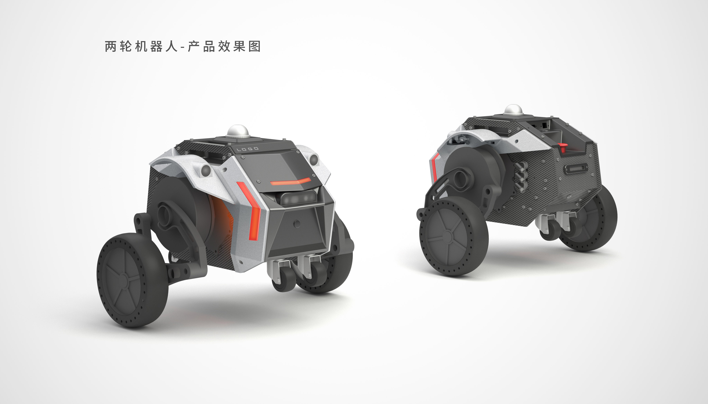

# Welcome to HCX-Development Documentation!

```{toctree}
:maxdepth: 1
:caption: HCX-Development-Doc
pages/Usage
pages/Node
```

基于 diablo 平台的 `HCX` 机器人支持 2D 的室内外自主导航功能，您可以通过 `ROS2` 快速上手。如果您不准备使用 `ROS` 进行开发，也可以通过在 [ROS](https://github.com/DDTRobot/diablo-sdk-v1) 中修改 `CMakeLists` 的方式仅对源码进行编译。我们将持续更新 `HCX` 机器人的 `ROS2` 的功能节点 , 希望能对您的机器人开发有所帮助。



## 整机配置

- 高性能运算平台 NUC
- RGB-D 深度相机 RealSense 系列
- 比肩多线的高性能激光雷达 Livox 系列
- 4G 远程 FPV 摄像头
- 4G 高清数字图传一体远程遥控器
- 独立 4G DTU 模块（自带路由器）