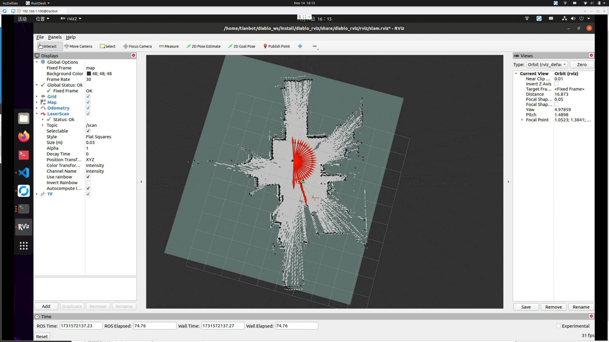

# HCX 机器人 SLAM 建图

```{toctree}
:maxdepth: 1
:glob:
```

```{contents} Contents
:depth: 2
:local:
```

## 2D 激光 SLAM 建图

### Gmapping 建图


```bash
ros2 launch diablo_slam gmapping.launch.py 
```


### SLAM_TOOLBOX 建图

```bash
ros2 launch diablo_slam slam_toolbox.launch.py
```


### Cartographer 建图

```bash
ros2 launch diablo_slam cartographer_2d.launch.py
```


## 查看 2D 栅格地图

```bash
ros2 launch diablo_rviz view_map.launch.py
```

## 保存并 2D 栅格地图

```bash
ros2 launch diablo_slam map_save.launch.py 
```

保存时，`终端日志`中会显示地图文件的将要保存到的`全局路径`，例如：
```bash
tianbot@diablo:~$ ros2 launch diablo_slam map_save.launch.py 
[INFO] [launch]: All log files can be found below /home/tianbot/.ros/log/2024-11-14-16-17-21-378905-tianbot-483835
[INFO] [launch]: Default logging verbosity is set to INFO
[INFO] [map_saver_cli-1]: process started with pid [483871]
[map_saver_cli-1] [INFO] [1731572241.495636712] [map_saver_cli]: 
[map_saver_cli-1] 	map_saver_cli lifecycle node launched. 
[map_saver_cli-1] 	Waiting on external lifecycle transitions to activate
[map_saver_cli-1] 	See https://design.ros2.org/articles/node_lifecycle.html for more information.
[map_saver_cli-1] [INFO] [1731572241.498539095] [map_saver_cli]: Creating
[map_saver_cli-1] [INFO] [1731572241.499058912] [map_saver_cli]: Saving map from 'map' topic to '/home/tianbot/diablo_ws/src/diablo_ros2/diablo_navigation2/maps/map_2024-11-14-161721' file
[map_saver_cli-1] [WARN] [1731572241.499094476] [map_saver_cli]: Free threshold unspecified. Setting it to default value: 0.250000
[map_saver_cli-1] [WARN] [1731572241.499118518] [map_saver_cli]: Occupied threshold unspecified. Setting it to default value: 0.650000
[map_saver_cli-1] [WARN] [map_io]: Image format unspecified. Setting it to: pgm
[map_saver_cli-1] [INFO] [map_io]: Received a 209 X 236 map @ 0.05 m/pix
[map_saver_cli-1] [INFO] [map_io]: Writing map occupancy data to /home/tianbot/diablo_ws/src/diablo_ros2/diablo_navigation2/maps/map_2024-11-14-161721.pgm
[map_saver_cli-1] [INFO] [map_io]: Writing map metadata to /home/tianbot/diablo_ws/src/diablo_ros2/diablo_navigation2/maps/map_2024-11-14-161721.yaml
[map_saver_cli-1] [INFO] [map_io]: Map saved
[map_saver_cli-1] [INFO] [1731572241.580101996] [map_saver_cli]: Map saved successfully
[map_saver_cli-1] [INFO] [1731572241.580286026] [map_saver_cli]: Destroying
[INFO] [map_saver_cli-1]: process has finished cleanly [pid 483871]
```

```{note}
保存地图时，请确保机器人已经停止运动，否则保存的地图可能不完整。
保存时，`终端日志`中会显示地图文件的将要保存到的`全局路径`，例如：
- `Saving map from 'map' topic to '/home/xxx/diablo_ros2/diablo_navigation2/maps/` 
目录下。

如果保存的地图文件较大，保存过程可能需要一些时间，请耐心等待。有一定可能保存失败，请重新尝试。
```