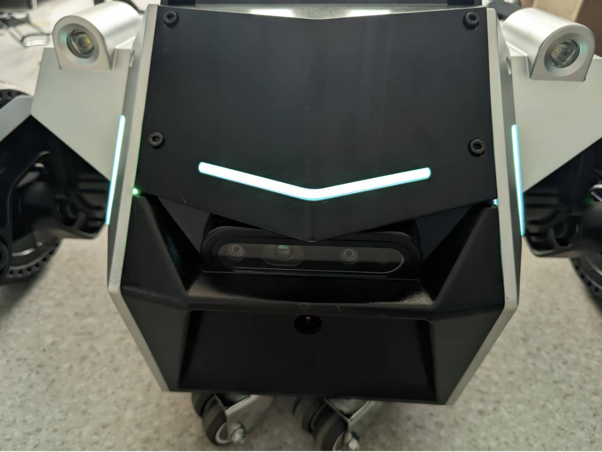
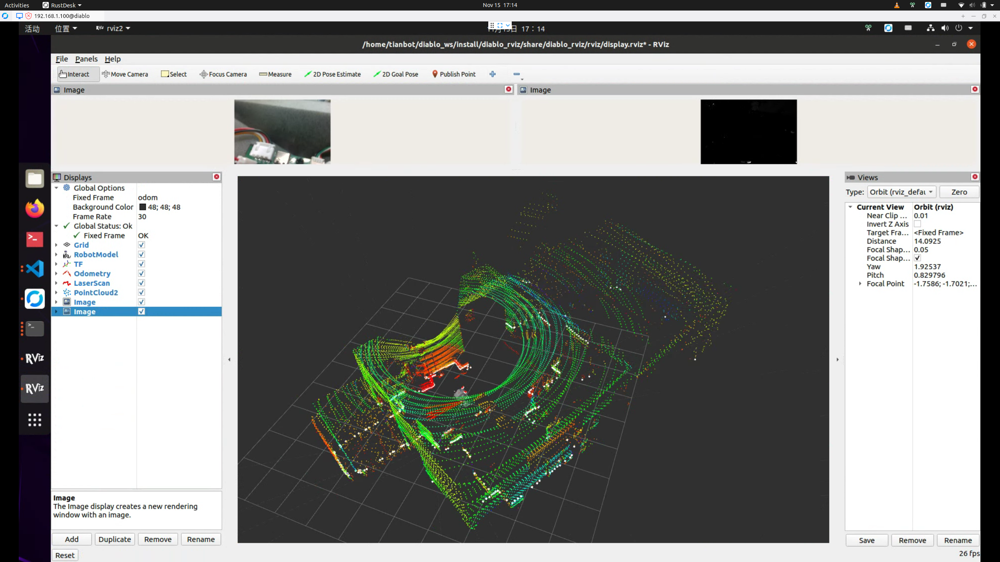

# 启动整机驱动和可视化传感器数据

```{toctree}
:maxdepth: 1
:glob:
```

```{contents} Contents
:depth: 2
:local:
```

## 启动整机 ROS 驱动

- 启动底盘驱动
- 启动传感器驱动
- 启动外设驱动

```
ros2 launch diablo_bringup diablo_bringup.launch.py
```

```{note}

如何在启动整机驱动的终端中出现如下错误：请结束驱动后，重新启动整机驱动。
- [ekf_node-14] [ERROR] [1732523155.702111265] [ekf_filter_node]: Critical Error, NaNs were detected in the output state of the filter. This was likely due to poorly coniditioned process, noise, or sensor covariances.
- [pointcloud_to_laserscan_node-15] Error:   TF_NAN_INPUT: Ignoring transform for child_frame_id &quot;base_footprint&quot; from authority &quot;Authority undetectable&quot; because of a nan value in the transform (-nan -nan -nan) (-nan -nan -nan -nan)
- [pointcloud_to_laserscan_node-15]          at line 298 in /tmp/binarydeb/ros-galactic-tf2-0.17.5/src/buffer_core.cpp
- [pointcloud_to_laserscan_node-15] Error:   TF_DENORMALIZED_QUATERNION: Ignoring transform for child_frame_id &quot;base_footprint&quot; from authority &quot;Authority undetectable&quot; because of an invalid quaternion in the transform (-nan -nan -nan -nan)
- [pointcloud_to_laserscan_node-15]          at line 317 in /tmp/binarydeb/ros-galactic-tf2-0.17.5/src/buffer_core.cpp
- [ekf_node-14] Error:   TF_NAN_INPUT: Ignoring transform for child_frame_id &quot;base_footprint&quot; from authority &quot;Authority undetectable&quot; because of a nan value in the transform (-nan -nan -nan) (-nan -nan -nan -nan)
- [ekf_node-14]          at line 298 in /tmp/binarydeb/ros-galactic-tf2-0.17.5/src/buffer_core.cpp
- [ekf_node-14] Error:   TF_DENORMALIZED_QUATERNION: Ignoring transform for child_frame_id &quot;base_footprint&quot; from authority &quot;Authority undetectable&quot; because of an invalid quaternion in the transform (-nan -nan -nan -nan)
- [ekf_node-14]          at line 317 in /tmp/binarydeb/ros-galactic-tf2-0.17.5/src/buffer_core.cpp
- [ekf_node-14] [ERROR] [1732523155.752382101] [ekf_filter_node]: Critical Error, NaNs were detected in the output state of the filter. This was likely due to poorly coniditioned process, noise, or sensor covariances.
- [ekf_node-14] Error:   TF_NAN_INPUT: Ignoring transform for child_frame_id &quot;base_footprint&quot; from authority &quot;Authority undetectable&quot; because of a nan value in the transform (-nan -nan -nan) (-nan -nan -nan -nan)
```

ROS 驱动成功启动后，LED 氛围灯会常亮，表示驱动启动成功。



## 如何关闭驱动

```{note}
请注意关闭建图、导航等程序也是，后续不再重述

1. 点击运行`ros2 xxx xxx xxx`的终端后
2. 使用 Ctrl+C 操作
```

```{tip}
单击运行`ros2 launch diablo_bringup diablo_bringup.launch.py`启动整机驱动的终端后，

需要按下键盘上的`Ctrl+C`按键，即可向程序发送程序结束命令。然后等待程序结束即可。
```

### 如何判断程序是否结束

```{note}
如在`ros2 launch diablo_bringup diablo_bringup.launch.py`启动整机驱动的终端中，出现以下提示，则表示程序已经结束。

- ^C[WARNING] [launch]: user interrupted with ctrl-c (SIGINT)
- [ekf_node-14] [INFO] [1732508443.614860079] [rclcpp]: signal_handler(signal_value=2)
- [static_transform_publisher-11] [INFO] [1732508443.614760239] [rclcpp]: signal_handler(signal_value=2)
- [diablo_ctrl_node-6] [INFO] [1732508443.614761786] [rclcpp]: signal_handler(signal_value=2)
- [static_transform_publisher-9] [INFO] [1732508443.614760294] [rclcpp]: signal_handler(signal_value=2)
- [static_transform_publisher-10] [INFO] [1732508443.614827033] [rclcpp]: signal_handler(signal_value=2)
- [robot_state_publisher-13] [INFO] [1732508443.614835078] [rclcpp]: signal_handler(signal_value=2)
- [static_transform_publisher-8] [INFO] [1732508443.614840605] [rclcpp]: signal_handler(signal_value=2)
- [livox_ros_driver2_node-1] [INFO] [1732508443.614852701] [rclcpp]: signal_handler(signal_value=2)
- [pointcloud_to_laserscan_node-15] [INFO] [1732508443.614861184] [rclcpp]: signal_handler(signal_value=2)
- [odom_publish_node-17] [INFO] [1732508443.614853049] [rclcpp]: signal_handler(signal_value=2)
- [msg_convert_node-16] [INFO] [1732508443.614858505] [rclcpp]: signal_handler(signal_value=2)
- [realsense2_camera_node-2] [INFO] [1732508443.614794739] [rclcpp]: signal_handler(signal_value=2)
.........................................
```

## 在 rviz 中查看传感器数据

### 启动 rviz
```
ros2 launch diablo_rviz view_robot.launch.py 
```

```{note}
这一步需要先正确上电启动机器人，否则 rviz 无法获取传感器数据
```

### 查看机器人状态
点击左侧导航栏的“可视化”按钮，进入可视化界面，可以看到当前机器人所连接的传感器数据。

