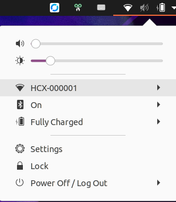
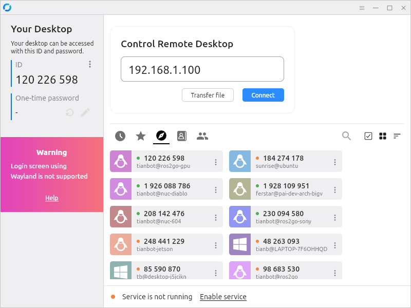
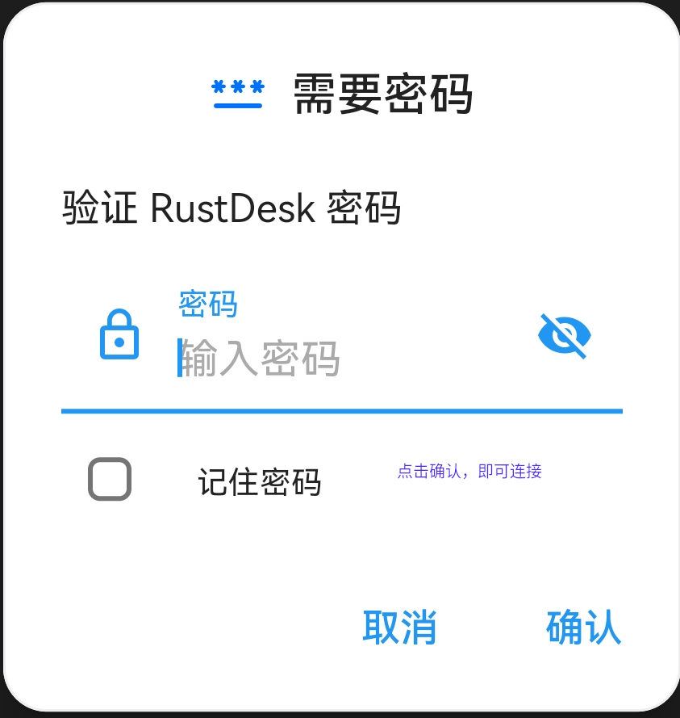

# 如何连接 HCX 机器人

```{toctree}
:maxdepth: 1
:glob:
```

```{contents} Contents
:depth: 2
:local:
```

## 准备工作

```{tip}
请检查机器人外观，确保没有损坏或丢失任何部件。
```

- 给机器人充电，确保电池电量充足。
- 给机器人上电，等待机器人启动完成。

## 网络连接

```{tip}
请确保电脑连接到了机器人自建的`HCX-00000x`热点下。

```{note}
热点密码为 `12345678`。
```

```

### ssh 连接
然后使用以下命令 ssh 连接到机器人：
```bash
ssh tianbot@192.168.1.100  # 密码为 ros
```

### Rustdesk 连接

- 详细流程请参考[使用 Rustdesk 远程连接](https://docs.tianbot.com/basic/rustdesk.html)

在窗口中输入 `192.168.1.100`，然后点击 `连接`。



```{note}
rustdesk 登录密码 `Tianbot_2016`
```



### 机器人上的 IP 地址

机器人上设备的 IP 地址如下表所示：
| 机器人 IP 地址 | 对应设备 |
| :---: | :---: |
| 192.168.1.2    |  4G 路由器地址，用于连接机器人  |
| 192.168.1.100  |  机器人（eth0）IP 地址        |
| 192.168.1.1xx  |  (sn 码的后两位)             |
| 192.168.1.201  |  FPV 网络摄像头 IP 地址       |

```{tip}
请确保机器人与电脑在同一网络下，并且能够通过 IP 地址访问。

即电脑连接到机器人自建的`HCX-00000x`热点下，或者连接到机器人所在的局域网。

- 机器人默认用户名：`tianbot`，默认密码：`ros`
```

## ROS2 多机通信 

```{tip}
将以下命令添加到 `~/.bashrc` 中，以确保您可以通过 LAN 访问 ROS Robots 节点
```

```bash
export ROS_DOMAIN_ID=5 
```

采用如下操作检查 ROS2 DOMAIN 通信是否正常
```bash
ros2 topic list
```

```{tip}
请确保机器人已经连接到网络，并且能够通过 IP 地址访问。
```