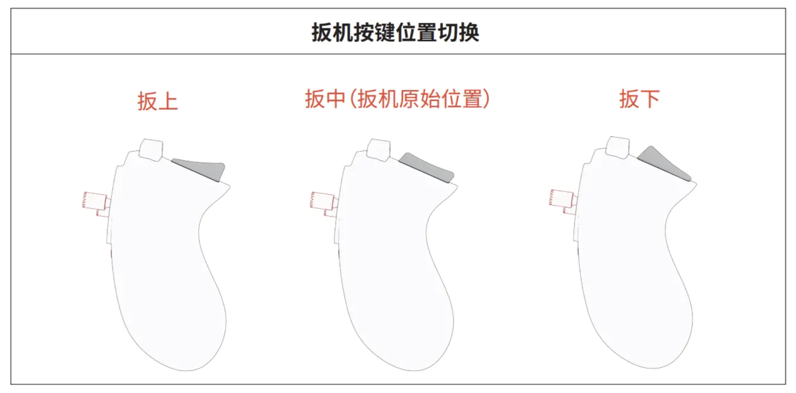

# HCX 机器人运动控制

```{toctree}
:maxdepth: 1
:glob:
```

```{contents} Contents
:depth: 2
:local:
```

## 遥控器控制


<!-- 

 -->

```{tip}
- 更多详细内容可以参考，[刑天用户手册](https://flbook.com.cn/c/ktbeSJAUxf?cckey=e488b34d#page/10)
```

## ROS 控制
在`ROS`部分，我们使用`geometry_msgs/Twist`消息来控制机器人的运动，该消息包含线速度和角速度。

```{note}
首先请确保运行了如下命令，正确启动了机器人整机 ROS 驱动
```

```bash
ros2 launch diablo_bringup diablo_bringup.launch.py
```

```{tip}
发现`rviz`界面全局轨迹正常生成，但是小车未动，请检查遥控器上是否禁用遥控模式
```

```{note}
一旦发现机器人快要发生碰撞或产生危险时，请立即将遥控器`右拨动开关扳至左侧或中侧`以切换到`遥控接管模式（ROS控制禁用模式）`
```

在发布方式上，有如下三种：

### 话题终端发布

```bash
ros2 topic pub /cmd_vel geometry_msgs/msg/Twist "{linear: {x: 0.1, y: 0.0, z: 0.0}, angular: {x: 0.0, y: 0.0, z: 1.0}}" -r 10
```

```{tip}
与 ROS1 不同，ROS2 的发布消息时自动补全不是很友好，需要手动以`类json`格式输入消息内
```

### rqt 可视化发布

```{figure} ../../_static/rqt_pub_gui.png
:name: rqt_teleop
:align: center
:width: 100%
```


### teleop 键盘控制

可以使用`teleop`包来控制机器人，运行如下命令即可：

```bash
ros2 run diablo_teleop teleop_node
```

```{danger}
- w：控制机器人向前移动。 （-1.0~+1.0米/秒）; （-1.6~+1.6米/秒Low-speed mode::High-speed mode::
- s：控制机器人向后移动。 （-1.0~+1.0米/秒）; （-1.6~+1.6米/秒Low-speed mode::High-speed mode::
- a：控制机器人左转。 （-5.0~+5.0 弧度/秒）Arbitrarily mode::
- d：控制机器人右转。 （-5.0~+5.0 弧度/秒）Arbitrarily mode::
- q：控制机器人向左倾斜。 （-0.2~+0.2弧度/秒）Standing mode::
- e：控制机器人向右倾斜。 （-0.2~+0.2弧度/秒）Standing mode::
- r：将机身倾斜角度调整为水平。Standing mode:
- z：将机器人切换到站立模式。
- x：将机器人切换到爬行模式。
- v：用于提升机器人的控制模式。 （0 ~ 1）Position mode 0:
- b：用于提升机器人的控制模式。 （-0.25 ~ +0.25 米/秒）Position mode 1:
- n：用于机器人头部俯仰的控制模式。 （0 ~ 1）Position mode 0:
- m：用于机器人头部俯仰的控制模式。 （-0.3~ +0.3 弧度/秒）Position mode 1:
- h：站立模式下的最小高度。Position mode
- k：站立模式下的中等高度。Position mode
- j：站立模式下的最大高度。Position mode
- u：控制机器人上仰。Position mode
- i：将机身调整为水平。Position mode
- o：控制机器人下仰。Position mode
- f：太空步。dance mode
- g：太空步结束。dance mode
- c：跳跃模式。Jump mode
- `：退出虚拟遥控器。
```