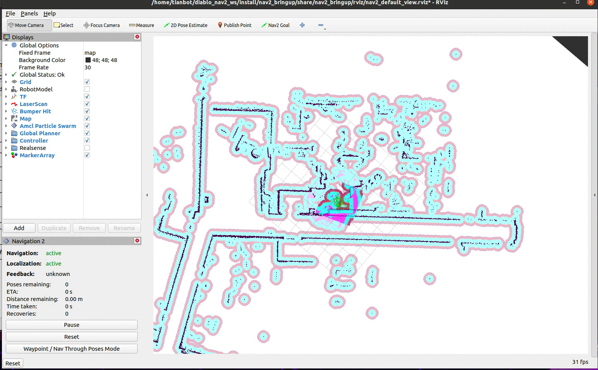

# HCX 机器人导航

```{toctree}
:maxdepth: 1
:glob:
```

```{contents} Contents
:depth: 2
:local:
```

## Navigation2 导航框架

diablo_navigation 基于 ROS2 的 Navigation2 框架，Navigation2 框架提供了多种导航算法，包括 A*、D*、RRT、RRT*、PRM 等，以及相应的路径规划、路径跟踪、避障等功能。


### 启动导航节点

```bash
ros2 launch diablo_navigation2 nav2.launch.py use_map:=xxxx  # 启动导航节点，并指定地图文件
```

```{note}
xxxx 为地图文件的名称，例如：/home/diablo/xxx.yaml，指定时无需添加`.yaml`后缀
```



### 设置初始位置 

通过 rviz 界面的 2D pose Estimate 给定机器人初始位姿


```{tip}
在设置初始位置时，需要尽量将`初始位置点`与机器人的`真实位置`相对应，姿态上有一点误差也问题不大，机器人会自动进行修正
```

### 设置规划导航点

利用 Navigation2 Goal 按键在地图上给定目标点，机器人则会自动开始规划路径进行导航


```{tip}
发现`rviz`界面全局轨迹正常生成，但是小车未动，请检查遥控器上是否禁用遥控模式
```