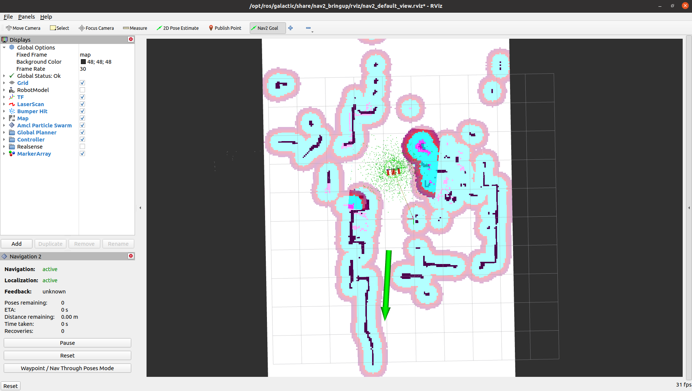

# HCX 机器人 2D 导航

```{toctree}
:maxdepth: 1
:glob:
```

```{contents} Contents
:depth: 2
:local:
```

## Navigation2 导航框架

diablo_navigation 基于 ROS2 的 Navigation2 框架，Navigation2 框架提供了多种导航算法，包括 A*、D*、RRT、RRT*、PRM 等，以及相应的路径规划、路径跟踪、避障等功能。

```{note}
首先请确保运行了如下命令，正确启动了机器人整机 ROS 驱动
```

```
ros2 launch diablo_bringup diablo_bringup.launch.py
```

### 启动导航节点

```
ros2 launch diablo_navigation2 nav2.launch.py use_map:=xxxx  # 启动导航节点，并指定地图文件
```

```{note}
xxxx 为地图文件的名称，例如：/home/diablo/xxx.yaml，指定时无需添加`.yaml`后缀
```

此时可以看到 rviz2 界面中已经加载了地图，并且机器人暂时还未启动导航模式，需要手动设置在地图中的初始位置

```{note}
如果没有加载地图，请检查`use_map：=`传输的地图文件路径是否正确，或者地图文件格式是否真实存在
```


### 设置初始位置

通过 rviz 界面的 `2D pose Estimate` 工具给定机器人初始位姿


```{tip}
在设置初始位置时，需要尽量将`初始位置点`与机器人的`真实位置`相对应，姿态上有一点误差也问题不大，
可以使用遥控器稍微挪动一下位置，机器人会自动进行修正
```

给定初始位置后，机器人会激活导航模式，并开始接受目标点并规划全局路径


### 设置导航目标点

利用 `Navigation2 Goal` 按键在地图上给定目标点，单击鼠标左键确认目标点位置后，继续拖动鼠标左键，选择到达目标点处的方向



此时看到，机器人已成功规划出全局路径，并准备开始向目标点移动


此时我们可以将遥控器上`右拨动开关扳至右侧`以切换到`遥控禁用模式（ROS控制模式）`，机器人则会自动开始规划路径进行导航

```{tip}
发现`rviz`界面全局轨迹正常生成，但是小车未动，请检查遥控器上是否禁用遥控模式
```

```{note}
一旦发现机器人快要发生碰撞或产生危险时，请立即将遥控器`右拨动开关扳至左侧或中侧`以切换到`遥控接管模式（ROS控制禁用模式）`
```